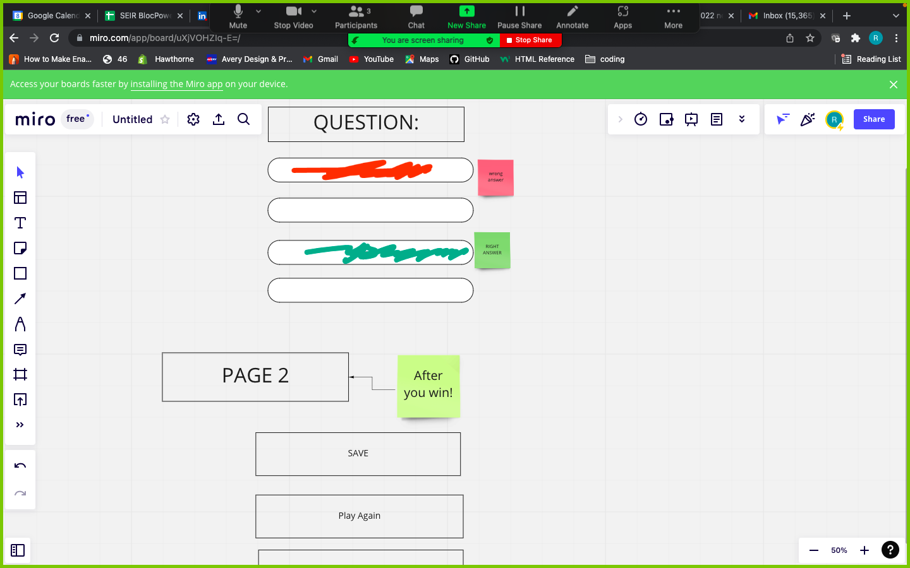

# cynthia-trivia-quiz
Test your knowledge with a series of questions and learn along the way. Trivia Consist of 5 rounds (each worth 100 points) Quiz modes include trivia, current events, . Once you answer a question correctly, you will move on to the next question. will track your progress which you can view on the homepage. !
When playing online, you can invite friends to beat your score.

## Game Rules:
1. The object of the game is to get the answers correct and beat your opponent's high score.

## wireframe

## userstories
4 questions
        - 4 questions
        - 100 points each 
        - Does this matter for our JavaScript code? Our CSS code? One or the other? Or both?
        - How do we keep track of a score.

    Which of the above game features are going to be controlled by CSS? HTML? JavaScript?
        - Game board
            Number of questions(HTML)
            Placement of buttons and feature of page (CSS)
        - Game status
            - Are the questions available and functioning (Javascript - for conditional)
            - Whose "turn" is it? (JavaScript - for loop and conditional)
            - Answer a question (JavaScript - event listener querySelector)
         
